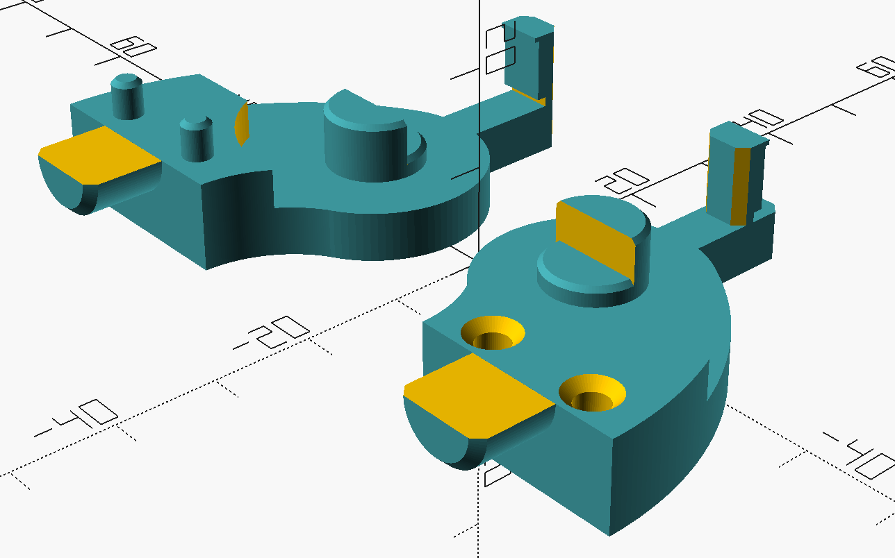
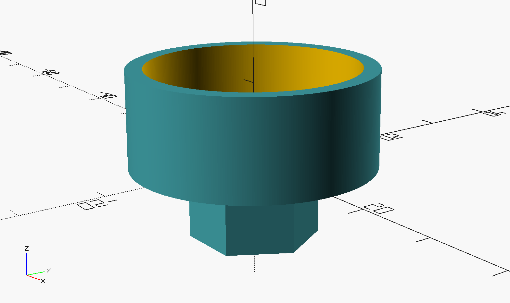

# Filament guide for Prusa i3 MK3

This is a parametric model for OpenSCAD of a filament guide to be placed on top of the Z axis top printed part. Is is a remix of the original [filament guide designed by Habony Norbert](https://www.printables.com/model/135950-filament-guide/files), which was designed only for 608 bearings.

## Dependencies

The vertical bearing model requires from the [Chamfers for OpenSCAD](https://github.com/SebiTimeWaster/Chamfers-for-OpenSCAD) from SebiTimeWaster to instantiate some primitives. Please refer to the installation instructions of its repo for further details.

